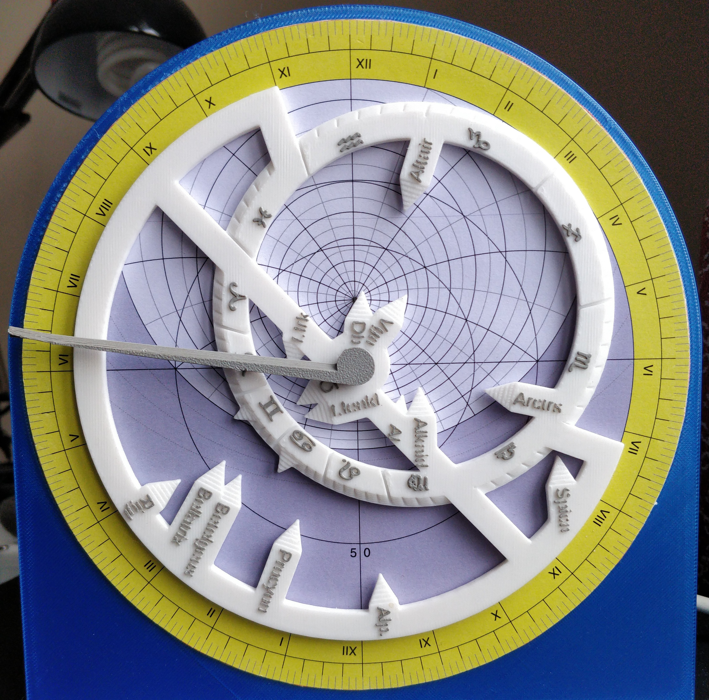
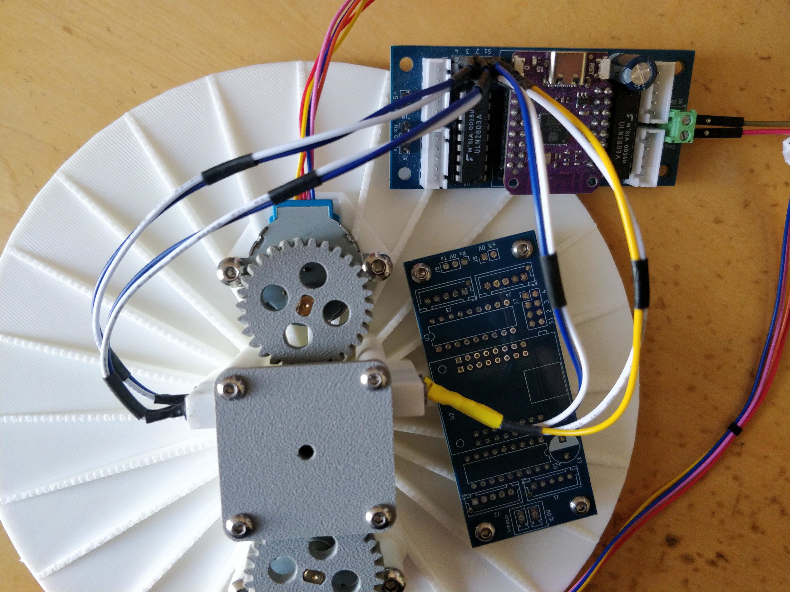
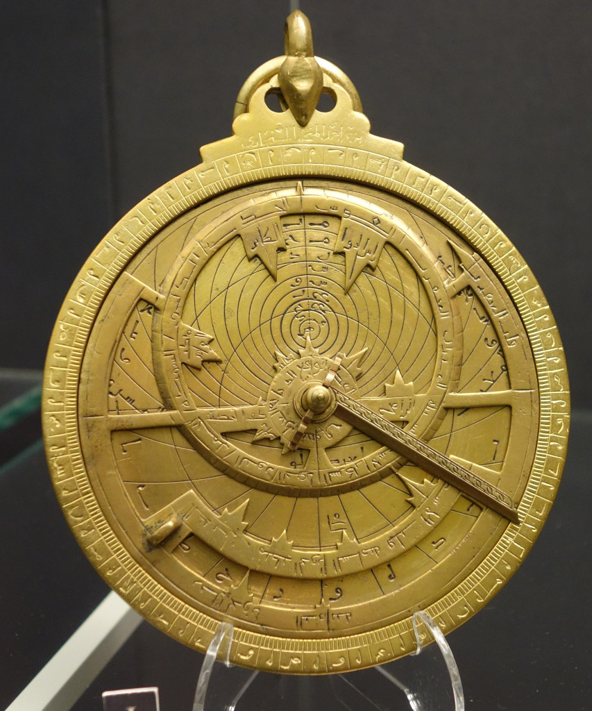
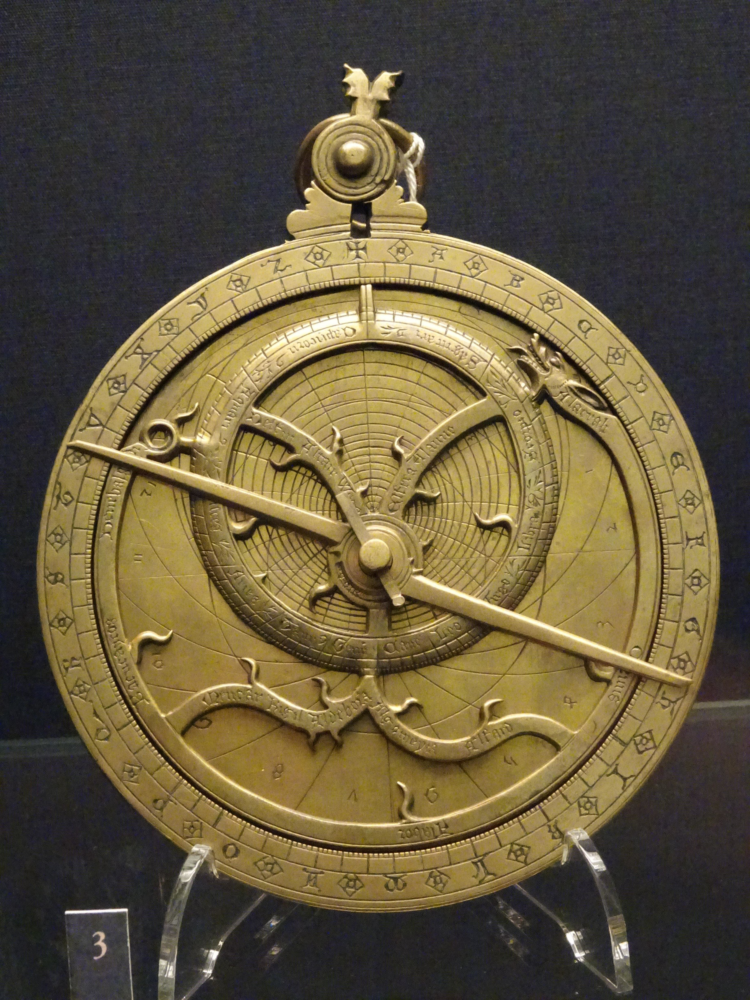

Astronomical clock / celestial computer based on the astrolabe.

Calculates the position of the sun and bright stars at a specific time and date.

Drives stepper motors and NTP-synchronized time displays.

Written in C++ (ESP32) for real-time control, Python for ephemerides.
OpenSCAD for 3D-printed mechanical parts.

Rear of the instrument during development, showing the ESP32 based stepper motor driver, 
the two motors and the mounts for the herring-bone gears
and the optical fiducial detectors.

My design is based on a specific 
[astrolabe](https://www.hsm.ox.ac.uk/collections-online#/item/hsm-catalogue-2112)
in the collection of the 
[History of Science Museum](https://www.hsm.ox.ac.uk)
in Oxford.

My other favourite is the Painswick astrolabe.
The decoration is fairly sparse, but one star is marked with a dragon's head.
The star names are Arabic, the signs of the Zodiac in Latin.
The hour markings are just alphabetic, so it predates the adoption of Arabic numerals for hour numbers.
But it does have Arabic numerals on the plate.
Perhaps the mater and the plate were made by different people?
The Sun / Hour marker spans the instrument. The Arabic one above just has half.
I'm not sure what the purpose of the whole span is.

I've been interested in these instruments since I was a child. 
The first ones I made were done with pen and paper, using compasses, ruler and a pocket calculator.

